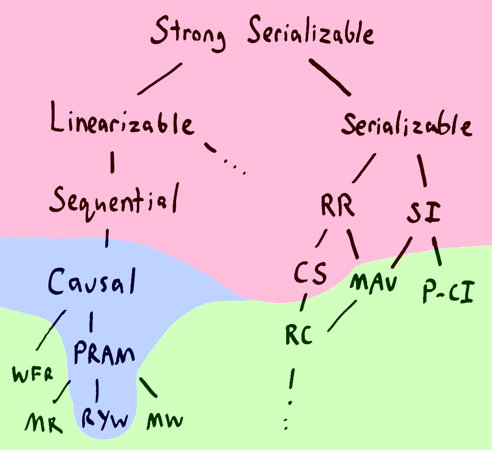
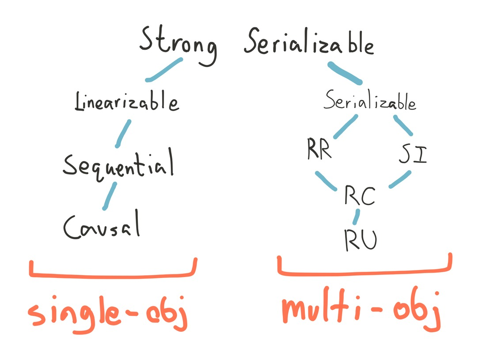

Distributed
===========

**Under construction - currently only brainstorming**

# Theory

* [2 Generals problem](https://en.wikipedia.org/wiki/Two_Generals'_Problem)
* [FLP Proof](http://www.cs.yale.edu/homes/aspnes/pinewiki/FischerLynchPaterson.html)
* [CAP](http://henryr.github.io/cap-faq/)
* [A critique of the CAP theorem](https://www.cl.cam.ac.uk/research/dtg/www/files/publications/public/mk428/cap-critique.pdf)
* [Fallacies of distributed computing](https://en.wikipedia.org/wiki/Fallacies_of_distributed_computing)
* [End to end argument in systems design](http://web.mit.edu/Saltzer/www/publications/endtoend/endtoend.pdf)
* [Stop calling databases CP or AP](https://martin.kleppmann.com/2015/05/11/please-stop-calling-databases-cp-or-ap.html)
* [Problems with CAP](https://dbmsmusings.blogspot.com/2010/04/problems-with-cap-and-yahoos-little.html) 
* Dynamo paper
* [Live beyond distributed transactions 2nd edition](https://queue.acm.org/detail.cfm?id=3025012)

# Practice

* Network partitions = network link misconfiguration, application pauses by GC etc
* RPC = CORBA, DCOM, .NET Remoting, gRPC, Thrift, Finagle
* CRDTs

## Verification

* Jepsen

# Concepts

## Consistency Models

### Strict/Strong Serializability

Combining serializability and linearizability yields strict serializability: transaction behavior is equivalent to some serial execution, 
and the serial order corresponds to real time. 
For example, say I begin and commit transaction T1, which writes to item x, and you later begin and commit transaction T2, which reads from x. 
A database providing strict serializability for these transactions will place T1 before T2 in the serial ordering, and T2 will read T1’s write. 
A database providing serializability (but not strict serializability) could order T2 before T1.2

### Linearizability

In plain English, under linearizability, writes should appear to be instantaneous. 
Imprecisely, once a write completes, all later reads (where “later” is defined by wall-clock start time) should return the value of that write 
or the value of a later write. Once a read returns a particular value, all later reads should return that value or the value of a later write.

Linearizability for read and write operations is synonymous with the term “atomic consistency” and is the “C,” or “consistency,” 
in Gilbert and Lynch’s proof of the CAP Theorem. We say linearizability is composable (or “local”) because, 
if operations on each object in a system are linearizable, then all operations in the system are linearizable.

### Serializability

It guarantees that the execution of a set of transactions (usually containing read and write operations) 
over multiple items is equivalent to some serial execution (total ordering) of the transactions.

Serializability is the traditional “I,” or isolation, in ACID. 
If users’ transactions each preserve application correctness (“C,” or consistency, in ACID), a serializable execution also preserves correctness. 
Therefore, serializability is a mechanism for guaranteeing database correctness.

See: 

 * Tannenbaums Distributed Systems
 * https://aphyr.com/posts/313-strong-consistency-models
 * http://www.bailis.org/blog/linearizability-versus-serializability/
 * http://www.bailis.org/blog/when-does-consistency-require-coordination/
 * http://www.bailis.org/blog/understanding-weak-isolation-is-a-serious-problem/
 * https://martin.kleppmann.com/2015/05/11/please-stop-calling-databases-cp-or-ap.html
 * https://arxiv.org/pdf/1302.0309.pdf

Currently a mix of ANSI DB and distributed models, a lot more work todo here:

 * (Strict) Linearizability (cache coherency protocols provide us strict consistency in our single process but multi threaded concurrent programs)
 * Sequential Consistency
 * Causual Consistency
 * Processor Consistency
 * PRAM/FIFO Consistency
 * Read your writes Consistency
 * Serializable
 * Repeatable read
 * Read committed
 * Dirty read
 * Eventual Consistency (not really defined well, http://www.bailis.org/papers/eventual-queue2013.pdf)
 * Consistency in CAP is not the C in ACID it is Linearizability

## ACID

 * http://www.bailis.org/blog/when-is-acid-acid-rarely/

## BASE

## CQRS and Event Sourcing

* Akka Persistence

## Atomic Commitment and Consensus

### 2PC

### 3PC

### Paxos

### Raft

### ZAB

# People to learn from

 * Leslie Lamport - no comment
 * The Erlang Team (Joe Armstrong etc)
 * The Akka Team (Boner, Kuhn, Klang)
 * Pat Helland (all his papers are superb)
 * Aphyr
 * Peter Bailis
 * Caitie McCaffrey
 * Martin Kleppmann

# Literature

Name | Author | Platform | Rating | Description |
-----|--------|----------|--------|-------------|
[There is No Now] | Justin Sheehy | - | 10 | Time in distributed systesm - you know |
[What we talk about when we talk about distributed systems] | - | - | - | - |
https://github.com/aphyr/distsys-class | Aphyr | - | 8+ | Aphyr's DS class |
[PBS or How eventual is eventual consistency] | Bailis | - | 10 | Finally something practical about EC | 

# Videos

Name | Recorded At | Speaker | Language/Platform | Rating | Description |
-----|-------------|---------|-------------------|--------|-------------|
Protocols of Interaction (https://www.infoq.com/presentations/protocols-microservices) | QCon London 2015 | Todd Montgomery | - | 9 | - | 
CRDTs Illustrated (https://www.youtube.com/watch?v=9xFfOhasiOE) | Strangeloop 2015 | Engelen | - | 8+ | Good intro to CRDTs |   
Transactions: myths, surprises and opportunities (https://www.youtube.com/watch?v=5ZjhNTM8XU8) | Strangeloop 2015 | Kleppmann | - | 9 | Good overview and entertaining |
The language of the system (https://www.youtube.com/watch?v=ROor6_NGIWU&t=792s) | 2012 | Hickey | Clojure | 9 | About systems integration |

[There is No Now]: https://queue.acm.org/detail.cfm?id=2745385
[What we talk about when we talk about distributed systems]: http://videlalvaro.github.io/2015/12/learning-about-distributed-systems.html
[PBS or How eventual is eventual consistency]: http://pbs.cs.berkeley.edu/#demo