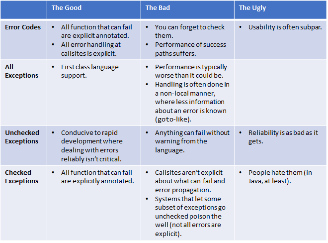

Error Handling
===============

Named error handling although it includes fault tolerance, fault prevention, error handling, error mitigation and error recovery.

**Under construction - currently only brainstorming**

* [The Error Model](http://joeduffyblog.com/2016/02/07/the-error-model/): Thanks to [Domo](https://github.com/Domo42) for finding+sharing this
  + The way errors are communicated and dealt with is fundamental to any language
* [On Erlang, State and Crashes aka Error kernel](http://jlouisramblings.blogspot.co.at/2010/11/on-erlang-state-and-crashes.html)
* Exceptions
  + [Vexing exceptions](https://blogs.msdn.microsoft.com/ericlippert/2008/09/10/vexing-exceptions/)
  + Dont use exceptions for flow control
* Null - just dont use it  
* [Considerations for Building Reliable Systems](http://bravenewgeek.com/take-it-to-the-limit-considerations-for-building-reliable-systems/): Unbounded anything is an anti pattern
* Erlang Supervisors, Links, Monitors
* Akka
* Crash only software
* Fail Fast
* Failure Modes
* Availability
* Reliability
* Failure masking
* Fault, Error, Failure
* Stability Patterns
* http://highscalability.com/blog/2013/2/27/42-monster-problems-that-attack-as-loads-increase.html
* [Rust Error Handling](https://doc.rust-lang.org/book/error-handling.html)
* [Zen of erlang](http://ferd.ca/the-zen-of-erlang.html)
* Graceful degradation when load > capacity

## What is an Error

Big challenge "define what an error actually is".
Most languages lump bugs and recoverable errors into the same category, and use the same facilities to deal with them.  
A null dereference or out-of-bounds array access is treated the same way as a network connectivity problem or parsing error.

 * On one hand, you had fail-fast – we called it abandonment – for programming bugs. 
 * And on the other hand, you had statically checked exceptions for recoverable errors.
 
## Ambitions and Learning

### Principles

 * **Usable**: It must be easy for developers to do the “right” thing in the face of error
 * **Concurrent**
 * **Diagnosable**: Debugging failures, either interactively or after-the-fact, needs to be productive and easy.
 * **Composable**
 
### Error Codes

error codes can have good reliability, but many programmers find them error prone to use; further, it’s easy to do the wrong thing – like forget to check one – which clearly violates the “pit of success”
caller must check it
constants representing the set of error codes
impressive track record going for them
functional languages use return codes disguised in monads and named things like Option<T>, Maybe<T>, or Error<T> coupled with a dataflow-style of programming and pattern matching, feel far more natural

baggage:

    * Performance can suffer.
    * Programming model usability can be poor.
    * The biggie: You can accidentally forget to check for errors
    
Midori: For what it’s worth, forgetting to use return values in our language was a compile time error. You had to explicitly ignore them.

Programming Model:

It’s common that many errors in a given function should share some recovery or remediation logic. C uses goto. In java you use finally blocks to encode this “before scope exits” pattern more directly.

Returns two values, one via return code the other via pointer parameter.
Return a structure that can contain either success or error value.

Go has multi valued returns.
Rust uses monadic error values. [Rust Error Handling](https://doc.rust-lang.org/book/error-handling.html)

### Exceptions

[Exception Handling: Issues and a Proposed Notation](https://www.cs.virginia.edu/~weimer/2006-615/reading/goodenough-exceptions.pdf)
Sadly, the most commonplace model – unchecked exceptions – is the worst you can do in this dimension.
For these reasons, most reliable systems use return codes instead of exceptions. They make it possible to locally reason about and decide how best to react to error conditions.
[The trouble with checked Exceptions](http://www.artima.com/intv/handcuffs.html)
[Exception Safety](https://en.wikipedia.org/wiki/Exception_safety)
[Mars Rover C++ Exceptions](https://youtu.be/3SdSKZFoUa8?list=WL&t=2304)
[Google C++ Guide](https://youtu.be/NOCElcMcFik?list=WL&t=1221)

For robust systems programs, don’t use exceptions.

**Unchecked Exceptions**

You throw and catch exceptions, without it being part of the type system or a function’s signature.
It’s difficult for anyone to reason about a program’s state at the time of the throw, the state changes that occur while that exception is propagated up the call stack – 
and possibly across threads in a concurrent program – and the resulting state by the time it gets caught or goes unhandled.

**Checked Exceptions**

Fail:

 * Exceptions are used to communicate unrecoverable bugs, like null dereferences, divide-by-zero
 * You don’t actually know everything that might be thrown, thanks to our little friend RuntimeException
 * versioning your interfaces is a pain in the ass
 
The resulting model seems to be the worst of both worlds. It doesn’t help you to write bulletproof code and it’s hard to use.

**Universal Problems with Exceptions**

 * throwing an exception is usually ridiculously expensive
 * Not having static type system information makes it hard to model control flow in the compiler, which leads to overly conservative optimizers.
 * encouraging too coarse a granularity of handling errors. huge catch blocks without carefully reacting to individual failures
 * control flow for throws is usually invisible. Silent control flow is just as bad as goto, or setjmp/longjmp, and makes writing reliable code very difficult.



## Bugs Aren’t Recoverable Errors

**Recoverable error**: markup text being parsed, user input from a website, or a transient network connection failure.
In these cases, programs are expected to recover. Predictable and, frequently, planned situation, despite being called an “error.”

**Unrecoverable error aka bug**: Logic is wrong.
Such problems often aren’t even detected promptly; it takes a while until “secondary effects” are observed indirectly, 
at which point significant damage to the program’s state might have occurred.
All data structures reachable by this code are now suspect.
Depending on the isolation guarantees of your language, perhaps the entire process is tainted.

You usually don’t hear of languages suggesting two different techniques for error handling.

**Abandonment**
In Midori bugs cause abandonment = fail fast.
C# has Environment.FailFast; C++ has std::terminate; Go has panic; Rust has panic!
The scope of this context depends on the system –
for example, C# and C++ terminate the process, Go the current Goroutine, and Rust the current thread, optionally with a panic handler attached to salvage the process.
Haskel: It cannot be handled or fixed at runtime, it can only be fixed by its developer. Thus there should be no according return code, but instead there should be asserts.
Abandoning fine grained mutable shared memory scopes (threads, coroutines) is suspect unless your system somehow makes guarantees about the scope of the potential damage done.
Proceeding in the face of a bug is dangerous when you’re trying to build a robust system.
"Process" state is transient by design. In a well designed system it can be thrown away and recreated on a whim.
Corrupted persistet state must be dealt differently.
Regularly journaling and checkpointing precious persistent state to allow abandonment.
In Modiri all unannotated over/underflows were considered bugs and led to abandonment. 9 times out of 10, this approach helped to avoid a problem

**Building reliable systems**
The error model must make errors transparent and easy to deal with.
Architect your system so that the whole remains functional even when individual pieces fail, and then teach your system to recover those failing pieces gracefully
Isolation is critical.

> The unavoidable price of reliability is simplicity. (C. Hoare).

Pointing out those connections with the messier outside world. 
Foundation of cheap and ever-present isolation. [Zen of erlang](http://ferd.ca/the-zen-of-erlang.html)
Repeated error checking when manually allocating memory it’s error prone and leads to huge amounts of frequently untested code-paths. 
And when code-paths are untested, they usually don’t work.
Developers in general do a terrible job making their software work properly right at the edge of resource exhaustion.

**Assertions**
Trigger abandonment. Release or debug only.
It’s better to find a bug at runtime than to proceed in the face of one.
[The Power of Ten -Rules for Developing Safety Critical Code](http://pixelscommander.com/wp-content/uploads/2014/12/P10.pdf)

**Contracts**
Preconditions and postconditions.
This is most often used to validate arguments. Sometimes it’s used to validate the state of the target object.
A contract was as important as a method’s return and argument types. Just an extension of the type system.
Self-describes the contract of the API in a way that documents itself and is easy to understand by callers.
Contracts should be part of the signature and not the implementation.
In Miori
 * by default checked at runtime. If a compiler could prove truth or falsehood at compile-time, it was free to elide runtime checks or issue a compile-time error
 * contracts and assertions were proven side-effect free.
 * If any of these contracts are found to be false at runtime, abandonment occurs
 * 90-something% of the typical uses of exceptions in .NET and Java became preconditions. ArgumentNullException, ArgumentOutOfRangeException, and related types and, more importantly, the manual checks and throws were gone

**Recoverable Errors: Type-Directed Exceptions**
Examples:
 * File or Network I/O
 * Validating user data (web form submission -> should be as specific as possible to reduce errors)

Usually don’t want to trigger abandonment. The program expects it from time to time.
An exception, as with error codes, is just a different kind of return value! Its part of the contract.
**If you look at most APIs that fail, they have a single failure mode anyway (once all bug failure modes are done with abandonment): IO failed, parsing failed, etc**
And many recovery actions a developer tends to write don’t actually depend on the specifics of what exactly failed when, say, doing an IO.
Most of the information in modern exceptions are not actually there for programmatic use; instead, they are for diagnostics.
In java ```catch (FooException)``` is essentially hiding a dynamic type test.
Intended best practices of handling errors as locally as possible.

In Midori:
 * had kind of checked exceptions, ```throws``` keyword and ```try``` expression
 * 90-something% of the functions in our system could not throw exceptions!
 * Exceptions thrown by a function became part of its signature, just as parameters and return values are.
 * Difference to Javas checked exceptions
   + The fact that the lion’s share of errors were expressed using abandonment meant most APIs didn’t throw.
   + The fact that we encouraged a single mode of failure simplified the entire system greatly. Also easy to go from multi failure mode to single and back again.
 * if you tried to catch something that wasn’t declared as being thrown, we could give you an error about dead code

**Aborts**
Like uncatchable exceptions until a defined point.

**Keepers**
Like default exceptions handlers.

**Principles i established over the last 10 years**

 * Code "blocks" that mutate state should be as small as possible
 * Dont use *null*
 * Make side effects explicit, if possible via dedicated types: Future, Optional, ResultObject
 * Use the type system
 * Dont work with threads, use higher level constructs like Queues, Actors, Event Loops, Futures etc
 * Define a threading model and know all your threads by name and what objects they are touching
 * Dont let other unexperienced people work with threads
 * Dont block threads if possible
 * Prefer immutability
 * Prefer result objects over checked exceptions in java
 * Dont use exceptions for flow control
 * Use exceptions for programming errors (NPE, index out of bounds)
 * Define exception boundaries
 * Design for restartable or rollback/rollforward

# Papers, Articels etc

Name | Author | Rating | Description |
-----|--------|--------|-------------|
[Making reliable distributed systems in the presence of sodware errors] | Joe Armstrong | 9 | Very good read |
[My presentation about fault tolerance](building-reliable-software.pptx) | David Leonhartsberger | 7 | My first presentation |

# Books

Name | Author | Rating | Description |
-----|--------|--------|-------------|
Release it! | Nygard | 9 | Classic one about software FT |
Patterns for Fault Tolerant Software | Hammer | 9 | Favorite ones about software FT |

# Videos


[Making reliable distributed systems in the presence of sodware errors]: http://erlang.org/download/armstrong_thesis_2003.pdf