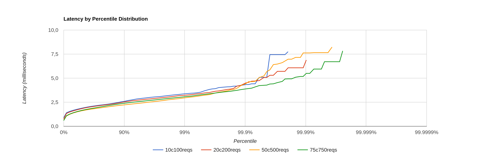
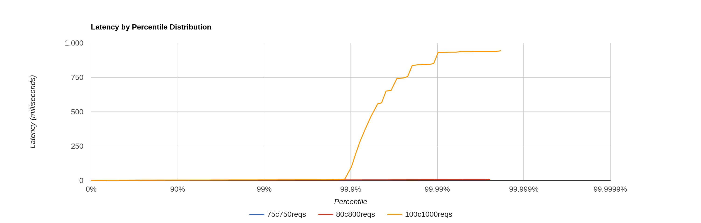
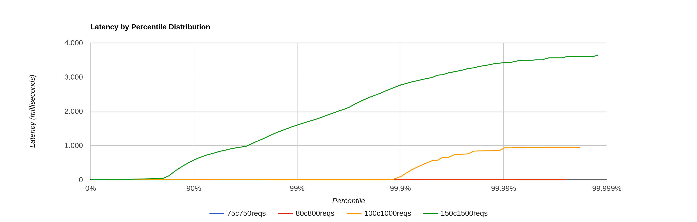

Raspberry HTTP Experiment
=========================

# Setup

Target: [Raspberry Pi 3 Model B](../../../env/home-pi3)

```bash
$ docker run -d -p 80:80 hypriot/rpi-busybox-httpd
```

# Load

Load generator: [wrk2](https://github.com/giltene/wrk2)

```bash
$ wrk2/wrk -t2 -c10 -d60s -R100 --latency http://10.0.0.200:80/index.html > 10c100reqs
$ wrk2/wrk -t2 -c20 -d60s -R200 --latency http://10.0.0.200:80/index.html > 20c200reqs
$ wrk2/wrk -t2 -c50 -d60s -R500 --latency http://10.0.0.200:80/index.html > 50c500reqs
$ wrk2/wrk -t2 -c75 -d60s -R750 --latency http://10.0.0.200:80/index.html > 75c750reqs
$ wrk2/wrk -t2 -c80 -d60s -R800 --latency http://10.0.0.200:80/index.html > 80c800reqs
$ wrk2/wrk -t2 -c100 -d60s -R1000 --latency http://10.0.0.200:80/index.html > 100c1000reqs
$ wrk2/wrk -t2 -c150 -d60s -R1500 --latency http://10.0.0.200:80/index.html > 150c1500reqs
```

# Results

Until 75 connections and 750 req/sec total



Up to 100 connections and 1k req/sec, seems that we hit saturation



150 connections and 1.5k req/sec, complete overload



# Conclusions

Seems that we hit saturation at about 800 req/sec.