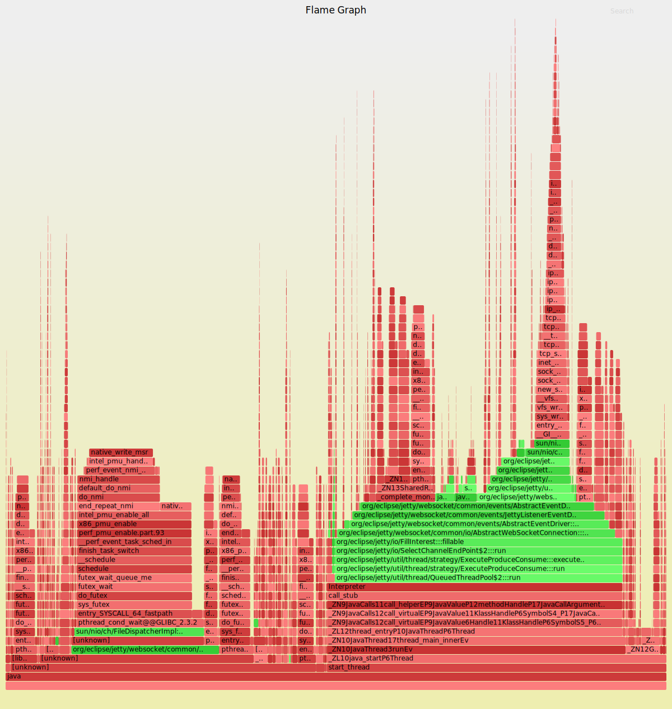

# My first flame graph

See: [Flame Graphs](../../../performance.md#flame-graphs)

Java app must be started with ```-XX:+PreserveFramePointer``` (expect up to ~2% performance degradation)

```
$ cd ~/tools
$ git clone https://github.com/brendangregg/FlameGraph
$ git clone https://github.com/jrudolph/perf-map-agent
$ cd perf-map-agent
$ cmake .
$ make
$ export FLAMEGRAPH_DIR=~/tools/FlameGraph
$ JETTY_PID=`ps -f -C java | grep jetty | awk '{ print $2 }'`
$ bin/perf-java-flames $JETTY_PID
```



<a href="first_flamegraph.svg">
  
</a>